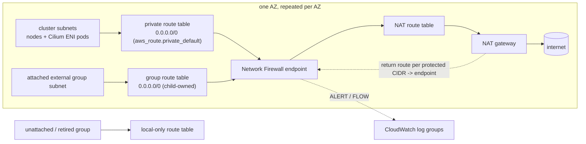

# Managed egress firewall (`egress_network`)

Feature and module reference for `egress_firewall.enabled = true` in
`aws-provision-karpenter`: AWS Network Firewall + per-AZ NAT with default-deny
public IPv4 egress and a Suricata rule set generated from the common
`egress_firewall` policy contract. The root README keeps the overview and
input/output rows; deployment-specific procedures and raw validation evidence
are maintained privately.

Contents: [architecture](#architecture-and-traffic-path) ·
[root configuration](#root-configuration-and-consumer-wiring) ·
[child interface](#child-module-interface) ·
[policy semantics](#policy-semantics-and-platform-baseline) ·
[operations and lifecycle](#operations-lifecycle-and-limitations) ·
[Tailscale](#optional-integration-hosting-a-tailscale-peer-relay)

## Architecture and traffic path



Enabled mode requires `cni = "cilium"` and rebuilds egress for a
Ryvn-provisioned VPC as `private subnet -> AZ-local Network Firewall endpoint
-> AZ-local NAT -> IGW`, default-deny on public IPv4 with hostname (SNI/Host)
and narrow IP/port exceptions. Disabled mode (the default) keeps the legacy
network behaviour: single NAT, one private route table, S3 gateway endpoint
included. It is not byte-for-byte the previous module (the VPC module moved
from 5.14 to 5.21 alongside this work; review the plan for provider-driven
diffs), and the enable/disable flip itself replaces the NAT gateways, route
ownership and public egress IPs, so it is a migration, not a toggle.

Enabled mode drops the S3 gateway endpoint so image layers take the inspected
NAT path. That path is billed as Network Firewall data processing plus NAT, but
AWS's [Network Firewall pricing](https://aws.amazon.com/network-firewall/pricing/)
waives the standard NAT gateway hourly and per-GB processing charges for
traffic that also passes a firewall endpoint on the same path (check the
current conditions for your region), so do not assume the two fees simply add.
A restricted S3 gateway endpoint (endpoint policy allow-listing verified
platform and customer buckets, attached to every protected route table) is a
documented proposal in `aws-validation.md`, not an implemented mode. Private
endpoints, VPC-local paths and PrivateLink are not inspected by this firewall
and are governed separately.

Only public IPv4 is covered. `HOME_NET` is the cluster's primary and secondary
CIDR subnets plus attached external groups; unattached or retired space is
excluded.

## Root configuration and consumer wiring

These are **root-module** inputs of `aws-provision-karpenter`; the child module
below has a different, native interface.

```hcl
cni = "cilium"                       # IRSA for the Cilium operator only; Cilium itself is installed by the environment's bootstrap

egress_firewall = {
  enabled            = true
  change_protection  = true          # Network Firewall delete/subnet/policy protection on the firewall object only
  cluster_policy_key = "cluster"     # the policy the EKS subnets use; receives the platform baseline
  policies = {
    cluster = {
      domain_allow  = { vendor_api = { domains = ["api.vendor.com", "*.vendor.com"], protocol = "https" } }
      network_allow = { ntp = { destination_ipv4_cidrs = ["203.0.113.10/32"], protocol = "udp", destination_ports = [123], reason = "customer NTP" } }
    }
    api_clients = { domain_allow = { partner = { domains = ["api.partner.com"], protocol = "https" } } }  # no baseline
  }
}

# Network allocation for compute outside the cluster (module workload_subnet_groups/):
# ordered, append-only, no CIDR input. Cluster capacity is workload_subnets_per_az instead.
additional_subnet_groups = [
  { name = "api_clients", ipv4_prefix_length = 24, availability_zones = ["us-east-1a", "us-east-1b", "us-east-1c"] },
  { name = "small_jobs", ipv4_prefix_length = 26, availability_zones = ["us-east-1a", "us-east-1b"] },
]

# Security assignment: one group -> one policy. Creates no subnets.
egress_attachments = {
  api_clients = { subnet_group_key = "api_clients", policy_key = "api_clients" }
}
```

Customers never pick CIDRs inside a Ryvn-owned VPC. Every group and AZ gets a
subnet, a dedicated route table with only the VPC-local route and an
association, with no NAT/default route and no cluster, Karpenter, Cilium or
load-balancer discovery tags, independent of `egress_firewall.enabled`. Sizing,
the two-`/20` budget on a default `/16`, the append-only geometry guard
(allocation records are `prevent_destroy`: entries are never removed, only
retired) and the deliberate full-environment teardown steps are documented once
in [`../workload_subnet_groups/README.md`](../workload_subnet_groups/README.md).

`egress_attachments` assigns a group to a policy. The firewall child gets
the group's native subnet, CIDR and route-table IDs and adds the inspected
`0.0.0.0/0` route to each table plus the AZ NAT return route; `HOME_NET` and
source rules cover cluster + attached groups only. Removing the attachment
removes those routes (back to local-only, never unrestricted NAT). Rejected:
unknown or retired groups, a group assigned twice (even to the same policy),
`cluster` as an external class, attachments while disabled. Different groups
may share a `policy_key` without sharing the cluster baseline.

Root outputs: `additional_subnet_groups` (inventory keyed by name, not a
readiness token) and `egress_firewall`, whose `attachments` (schema_version 1)
is published only after routes and logging exist:

```hcl
resource "aws_instance" "worker" {
  for_each  = module.platform.egress_firewall.attachments["api_clients"].subnets_by_az
  subnet_id = each.value.subnet_id   # also ipv4_cidr, route_table_id
}
```

`egress_firewall` also carries `platform_baseline`, `effective_rules`,
`firewall_arn`, `firewall_endpoints`, `nat_public_ips`, `nat_route_table_ids`,
`cluster_subnet_ids` (the primary per-AZ workload subnets, the EKS/load-balancer
selector), `protected_subnet_ids` (every subnet routed through the firewall),
`vpc_cidrs`, `cni`, `change_protection` and the alert/flow log group names.
Disabled mode returns the same object with `enabled = false`, empty maps/lists
and null ARNs. These describe configuration, not Cilium runtime health.

## Child module interface

The root wires `module.egress_network` from its own locals; callers of the root
never set these directly. Inputs that decide coverage:

- `vpc_cidr` + `vpc_cidrs`: every CIDR associated with the VPC. Protected
  subnets must fall inside one of them; each AZ NAT table gets one entry in
  `nat_local_routes` per CIDR (audit identifiers for drift checks; the module
  never owns those local routes).
- `cluster_subnets_by_az` / `cluster_source_cidrs_by_az` /
  `cluster_default_route_ids`: node and (secondary CIDR) pod subnets that form
  the cluster source class and `HOME_NET`, and the root-owned private default
  routes the child re-targets.
- `subnet_groups` (`map(object({ subnets_by_az = map(object({ subnet_id,
  ipv4_cidr, route_table_id })) }))`) + `attachments` (`map(object({
  policy_key, subnet_group_key }))`): external compute classes. The caller's
  network layer owns the subnets, route tables and associations and passes
  them in `subnet_groups`; each attachment assigns one group to one policy.
  The module adds the inspected default route to the group's tables and the
  NAT return routes, compiles the group's CIDRs as a source class and never
  creates subnets. A group can be assigned once; unattached groups are not
  part of `HOME_NET`. Attachments never receive the cluster baseline.
- `policies`, `cluster_policy_key`, `platform_https_domains`: the compiled
  policy set (root `egress_firewall.policies` plus the root's effective
  baseline list: built-ins plus root `platform_https_domains`).
- `firewall_subnet_cidrs`, `nat_subnet_cidrs`, `reserved_subnet_cidrs`,
  `igw_id`, `azs`, `name`, `tags`.
- `change_protection`: defaults `true`; set `false` in the apply before a
  destroy or AZ change (the provider does not lift it for you).

Outputs: `suricata_rules`, `effective_rules`, `cluster_subnet_ids`,
`attachments`, `nat_public_ips`, `nat_route_table_ids`, `nat_local_routes`,
`firewall_endpoint_ids`, `alert_log_group`, `flow_log_group`, `home_net`,
`firewall_arn`, `firewall_policy_arn`.

Deterministic tests: `terraform init -backend=false && terraform test` in this
directory (mock providers). Disposable cloud fixtures live under `fixtures/`;
they set `change_protection = false` so teardown needs no extra apply.

## Policy semantics and platform baseline

`egress_firewall.policies` is keyed by policy name; `cluster_policy_key`
(default `cluster`) names the one the EKS workload subnets use and every
external `egress_attachments[*].policy_key` must name an existing policy.
Each policy has:

- `domain_allow.<name>`: named rules, mirroring `network_allow`:

  ```hcl
  domain_allow = {
    vendor_api = {
      domains           = ["api.vendor.com", "*.vendor.com"]
      protocol          = "https"
      destination_ports = [443] # optional; defaults to 443 for https, 80 for http
    }
  }
  ```

  `domains` is a non-empty set of bare DNS names, exact (`api.example.com`)
  or leading-wildcard (`*.example.com`); `protocol` is required and is
  `https` (TLS SNI match) or `http` (HTTP `Host` match). The same protocol and
  port apply to every domain in the rule, and one Suricata rule is generated per
  domain with the stable identity
  `<class>/domain/<name>/<protocol>/<port>/<domain>`, so the same host under two
  rule names never collides. v1 accepts only `https`+443 and `http`+80; an
  explicit empty `destination_ports` or any other port is rejected at plan time
  until non-standard ports are validated separately. There is no `domain:port`
  syntax and no raw-rule input; a name on any other port needs a network rule.
  Wildcards are rejected when the suffix is a public suffix
  (`*.co.uk`, `*.xn--55qx5d.cn`), checked offline against the vendored,
  ASCII-normalised Public Suffix List (`public_suffix_list.dat` in this directory,
  refreshed with `update_public_suffix_list.py`).
- `network_allow.<name>`: `destination_ipv4_cidrs`, `protocol` (`tcp`/`udp`),
  `destination_ports`, `reason`. IP exceptions on TCP 80/443 bypass
  Host/SNI matching entirely; the effective output flags them as
  `bypasses_domain_matching`.

The platform baseline compiles separately as
`cluster/platform/https/443/<domain>` rules for the cluster class only; it is
never inherited by external attachments, even ones assigned the cluster's
policy key. It is the union of the root's built-in AWS/registry list
(`local.builtin_platform_https_domains` in `egress_firewall.tf`) and the root
input `platform_https_domains`, which adds exact HTTPS/443 hostnames and can
never remove a built-in. Entries are trimmed, lower-cased, stripped of a
trailing dot and de-duplicated; schemes, paths, ports, wildcards, IP literals
and single-label names are rejected at plan time. Both appear in
`egress_firewall.platform_baseline` and as `origin = "platform"` rules in
`effective_rules`.

Who fills `platform_https_domains`:

- **Ryvn-managed environments** (`ryvn-iac/blueprints/aws-platform.blueprint.yaml`,
  `aws-eks-karpenter` installation): the blueprint re-emits the environment
  config with `platform_https_domains` set to the caller's entries plus the
  hostnames derived from the managing hub context before the first
  infrastructure apply, without any cluster agent: hub API and issuer/token
  hosts, the access tunnel when the hub has one, and the collector's
  effective Loki/Mimir/token endpoints and enabled observability destinations,
  selected exactly as the `ryvn-collector` installation selects them (explicit
  `lokiUrl`/`mimirUrl`/`tokenUrl` inputs first, then the managing hub's own
  stack). URLs are parsed, paths stripped and hosts lower-cased; console/UI
  hosts are not included. A hub-context endpoint the firewall cannot express as
  HTTPS/443 (plain `http://`, another port, an IP literal) is passed through
  verbatim while the firewall is enabled, so the root's hostname validation
  fails the plan with the offending endpoint instead of the allowlist silently
  omitting a platform dependency; while disabled it is dropped, so development
  hubs are unaffected. Known gap: a hub without its own Loki/Mimir gateways
  leaves the collector on its chart defaults (central Ryvn), which are not
  derived; set the collector inputs or add the hosts explicitly. This wiring
  has deterministic render tests but has not been exercised against a live
  Ryvn customer environment.
- **Standalone Terraform callers** must list every non-AWS/registry host their
  platform components need (Ryvn hub API and issuer, telemetry gateways,
  tunnel) themselves; nothing is inferred. A customer rule that repeats a
baseline host keeps its own identity, with `platform_required = true` in the
effective output, so removing the duplicate does not revoke platform access.
`default_action` accepts only `"deny"`.

The module compiles both kinds into one managed stateful rule group (capacity
30000, immutable after creation, consuming the default policy budget of one
group; more groups are a quota/review item). Plan-time preconditions reject
duplicate or reserved rule SIDs, more than 30000 rules, a rule over 8192 bytes
or a rule string over 2,000,000 bytes, and exact duplicate or overlapping
source CIDRs, before anything is mutated. `egress_firewall.effective_rules`
lists every generated rule by stable identity
(`<class>/domain/<name>/<protocol>/<port>/<domain>`,
`cluster/platform/https/443/<domain>`, `<class>/network/<name>`) with its SID, origin (`customer` or `platform`),
protocol/ports/destination and reason. `platform_required` and
`customer_configured` preserve both sources when the same allowance appears in
the baseline and customer policy; deleting a customer entry does not revoke a
platform-required allowance.

## Operations, lifecycle and limitations

**Routing warning.** AWS Network Firewall only inspects a flow whose forward
and return packets pass through the same firewall endpoint
([asymmetric routing](https://docs.aws.amazon.com/network-firewall/latest/developerguide/asymmetric-routing.html)).
This module configures that routing for every protected subnet and AZ in one
resource graph; review each plan for route/association replacements, because
resource dependencies alone do not make a transition traffic-safe for nodes
that are already running. Out-of-band changes to the routes, route-table associations, firewall
policy, firewall endpoints/interfaces, or any alternate egress (extra NAT,
IGW route, second NIC, IPv6) can bypass inspection or drop traffic, and
**default-deny is not a guarantee after such a change**. This is a measured
result, not a general AWS statement: in isolated validation,
deleting only the cluster's per-subnet return route in
one NAT table — everything else intact — let a fresh, normally-forbidden TLS
connection reach its origin and return HTTP 200. Keep protected routing and
policy under one Terraform owner, restrict changes to reviewed provisioning
and break-glass identities, alert on changes, and re-run allow/deny canaries
after any modification.

Ordinary symmetric routing is the supported v1 baseline. Re-pointing each NAT
table's AWS-created VPC-local route at the firewall endpoint (so the exact
deletion above fails closed) was prototyped in the standalone
`fixtures/live` experiment (`adopt_nat_local_routes`) and is **not** part of the
supported root: it needs Terraform `import` blocks, which are root-only (a root
containing one cannot be consumed as a child module, and `import.for_each`
needs Terraform >= 1.7 where this module supports >= 1.5.7), and it does not
stop a privileged actor who can rewrite routes. If you applied that prototype
by hand, restore the route target to `local` (`ReplaceRoute`) **before**
removing the owning resource: AWS refuses to delete a local route and the
provider tolerates that error, so dropping the resource or its state leaves
the endpoint target in place (provider 6.66.0, r4/r5 fixtures).

Ownership:

| Concern | Module provides | Customer / account owner supplies |
|---------|-----------------|-----------------------------------|
| Topology | Firewall, per-AZ endpoints, NAT, all forward/return routes and associations for primary **and** every declared secondary VPC CIDR (Cilium pod CIDR), plan-time validation that protected subnets sit inside declared CIDRs and that the CNI is Cilium | No alternate egress in the VPC; secondary CIDR associations declared to the module |
| Policy | Suricata rule set generated from `egress_firewall.policies`; external attachments never inherit the cluster baseline; native alert + flow logs (`alert_log_group`, `flow_log_group`) | Reviewed policy changes through Terraform only. Traffic logs record what the firewall saw; they cannot show flows that bypassed it |
| Change protection | `change_protection` (default `true`) sets delete, subnet-change and policy-change protection on the firewall. AWS then rejects `DeleteFirewall`, subnet-mapping and policy-association changes, and the provider does **not** lift it: apply `change_protection = false` first when destroying or changing the AZ set, then restore. It protects the firewall object only: a `destroy` run against a protected firewall still removes routes, associations, NAT and logging before it fails on `DeleteFirewall`, so it is not a guard against a mistaken destroy of the network | Treat that flip as a break-glass change; protect the state/workspace against accidental `destroy` separately |
| Identifiers for monitoring | `egress_firewall` output: `firewall_arn`, `firewall_endpoints`, `nat_route_table_ids`, `cluster_subnet_ids` (the primary per-AZ workload subnets, the EKS/load-balancer selector), `protected_subnet_ids` (every subnet routed through the firewall, including additional workload subnets and attachments), `vpc_cidrs`, `effective_rules`, log groups; disabled mode returns the same object with `enabled = false`, empty maps/lists and null ARNs | CloudTrail/EventBridge alerts on `ec2:CreateRoute/ReplaceRoute/DeleteRoute`, `*RouteTableAssociation`, `network-firewall:Update*/Delete*`, `ec2:*VpcCidrBlock`, ENI attach on protected instances; a topology-aware drift check (reviewed `terraform plan` or a custom Config rule comparing routes to this output); a named remediation operator; allow/deny canaries after repair |
| Identities | Node, Karpenter, Cilium-operator and add-on IRSA roles carry only `ec2:Describe*` on route tables and no firewall permissions. The Ryvn agent executor role (`iam.tf`) defaults to `Allow *` minus data-plane denies, so it **can** rewrite routes and policy: it is the provisioning identity, not a workload one | Least-privilege workload and consumer roles with no route, association, firewall-policy or admin mutation; provisioning and break-glass identities reviewed ([IAM best practices](https://docs.aws.amazon.com/IAM/latest/UserGuide/best-practices.html)). If you add IAM/SCP conditions, verify each EC2 action's supported resource types and condition keys in the Service Authorization Reference first — not every route/association action accepts `aws:ResourceTag` — and protect the tags themselves |

What AWS-managed controls do and do not cover here:

- [Security Hub Network Firewall controls](https://docs.aws.amazon.com/securityhub/latest/userguide/networkfirewall-controls.html)
  check logging, deletion protection and policy settings on the firewall. They
  do not evaluate VPC routes, so they cannot prove symmetric NAT return
  routing.
- [Firewall Manager route-table management](https://docs.aws.amazon.com/waf/latest/developerguide/fms-manage-vpc-route-tables.html)
  is a conditional option, not a fix for this topology: its Monitor mode
  currently covers internet-gateway traffic (not NAT or other gateway
  targets), excludes centralized route management, reports findings rather
  than repairing, and may take up to 12 hours to notice a disassociation.
- AWS's routing-enhancement material documents the local-route override
  prototyped above as a valid pre-NAT inspection option; nothing in AWS
  documentation describes it, or any of the above, as protection against an
  authorized actor rewriting routes.

Lifecycle: first create is a single apply (network before cluster; the Cilium
bootstrap's image pulls transit the firewall). Adding an AZ or destroying
requires `change_protection = false` in a preceding apply; the shipped
provision/deprovision policies (`infra/perms/aws/permissions`, mirrored to
`repos/environments/aws-eks-byoc/permissions`) carry the
`network-firewall:Update*Protection`, `AssociateSubnets`/`DisassociateSubnets`,
`ListRuleGroups` (the provider lists rule groups while creating the policy) and
`ec2:ReplaceRoute` actions this needs, so it does not depend on an admin
identity. The private default route of each cluster route table is one root
resource in both modes (`aws_route.private_default`, NAT target when disabled,
AZ-local firewall endpoint when enabled), so a mode switch replaces the target
in place instead of racing two owners for the same `0.0.0.0/0`. Routing
cutovers on a live environment are still not traffic-neutral: enabling or
disabling replaces NAT gateways, public egress IPs and route-table
associations, and a disable run must be preceded by `change_protection = false`
or it removes the routes and NAT before failing on `DeleteFirewall`. Disabling
also deletes the firewall log groups; export the alert/flow evidence first.
The current boolean input does not expose build-only or per-AZ cutover stages.
An existing environment needs a reviewed maintenance plan and rollback.

Activation order: this module merges and ships with `enabled = false`, which
leaves the existing egress path alone. The only supported dataplane behind an
enabled firewall is a healthy Cilium ENI dataplane (ENI IPAM from the
protected cluster subnets, native routing, kube-proxy retained, no prefix
delegation), and it must be healthy before workloads are accepted, not before
the firewall is created:

- New environment: set `enabled = true` and `cni = "cilium"` from the first
  apply; the firewall and routes come up in that apply and the cluster/Cilium
  bootstrap runs inside the protected topology. No disabled-first apply.
- Existing VPC-CNI environment: a coordinated CNI migration to Cilium plus the
  topology cutover described above.

`cni = "cilium"` only creates the operator IRSA role; the root still installs
the VPC CNI add-on and does not install or verify Cilium, so the flag alone
does not yield a one-apply bootstrap. That needs an installer composed into
the root (the `ryvn-init` CodeBuild launcher of PR #8916 or an equivalent),
placed with `subnet_ids = local.node_subnet_ids` so the bootstrap job waits
for the firewall routes exactly as the node groups do, without depending on
node-group readiness (a Cilium/bootstrap cycle). The combined CodeBuild +
firewall first-apply path has not been live-validated. Any apply that flips
`enabled` is a maintenance event: isolate traffic, expect minutes of egress
loss per AZ and, if the apply fails part-way, a temporary loss of enforcement
or connectivity until it is rolled forward or back; re-run allow/deny canaries
after convergence before treating the environment as protected.

### Changes requiring migration

These inputs are intentional one-way or replacement decisions; the plan shows
the replacement, but the cost is only visible if you know to look:

| Change | Effect |
|--------|--------|
| Renaming an `egress_attachments` key or its `subnet_group_key` | Only firewall routes and source rules change; the group's subnets keep their IDs. Changing `policy_key` alone is a rule-only change |
| Raising `workload_subnets_per_az` | Additive: the cluster's growth slots (`/20`s 0–12 of the default `/16`) are reserved, and named groups are allocated from blocks 13–14 only, so the two never collide |
| Enabling/disabling the firewall, or changing the AZ set | Replaces NAT gateways and public egress IPs (`outbound_ips`); downstream allow-lists keyed on those IPs break. Isolated testing observed minutes of egress loss per direction, and a disable attempted against a protected firewall stops half-way (fail-open on the single NAT until rolled forward or back) |
| Disabling the firewall | Also deletes the Network Firewall alert/flow log groups with their retained evidence |
| Rule-group capacity | Internal, fixed at 30000, immutable after creation; a change means a new rule group and policy update |
| Enabling the firewall on a VPC with the S3 gateway endpoint | The endpoint is removed; S3 traffic moves to the inspected NAT path and bucket policies conditioned on `aws:SourceVpc` stop matching |
| `change_protection` | Protects the firewall object only (see the ownership table); it does not protect routes, associations, NAT or the network as a whole |
| Tightening an existing wildcard (`*.example.com` -> exact names) | Safe to plan, but live clients on the removed names lose connectivity at apply; stage it with the effective-rule output and alert logs |

Prerelease consumers that configured the root input under its earlier name
`aws_egress_attachments` must rename the key to `egress_attachments` (same
value shape, no alias); no resource or state address changes with it.
Likewise the root input **and** inventory output `workload_subnet_groups`
were renamed `additional_subnet_groups` (same shapes, no alias): rename the
config key and any `module.<root>.workload_subnet_groups` output reference.
The internal module label `module.workload_subnet_groups[0]`, its directory
and every child resource address are unchanged, so no state moves are needed
and the state-address snippets in the allocator README stay valid.

Allocator-side changes (editing/reordering/deleting `additional_subnet_groups` entries, upgrading from child-owned attachment subnets) are in [`../workload_subnet_groups/README.md`](../workload_subnet_groups/README.md#stability-guard).

### Evidence boundaries

Steady-state enforcement and ordinary destination-only policy edits behaved as
tested in an isolated three-AZ setup (pods, host network,
Karpenter replacement, external attachments). Not established: a
traffic-neutral or atomic mode switch; the root cause of one ~80 s pass-through
window observed on two AZs during an in-flight disable apply; Tailscale
PeerRelay forwarding; the same-worker NLB hairpin path; ECH. Named rules match
SNI/Host without decryption; this is not an IDPS. AWS managed services placed in
a group subnet do not thereby route their own service egress through the
firewall. A disabled-mode upgrade plan on an isolated existing environment showed
only a same-ID route move and new `terraform_data` records with zero destroys;
that is a plan-level check for that environment, not activation evidence.

## Optional integration: hosting a Tailscale peer relay

A customer running Tailscale participants (operator, `PeerRelay`, app sidecars)
in protected subnets uses the ordinary policy inputs; the firewall has no
Tailscale toggle and grants no UDP by itself. Stage it in two applies so the
network never depends on a Kubernetes Service the same environment creates:

```hcl
# 1. Coordination/DERP over TLS 443. Either the customer-chosen suffix below or
#    the exact names (controlplane/login/log.tailscale.com plus the DERP
#    hostnames from the tailnet's effective DERP map; derpN-all aliases are
#    DNS/IP aliases, not the SNI the firewall sees).
domain_allow = {
  tailscale_control = { domains = ["*.tailscale.com"], protocol = "https" }
}

# 2. After the PeerRelay's NLB exists: its public IPv4 addresses (or
#    pre-allocated EIPs), UDP 41641 (operator 1.102.4 has no spec.service.port).
#    Both sides of a relayed connection, including pods in this cluster, send
#    UDP to that public address, so it is ordinary inspected egress even though
#    the targets are private pod IPs. Replacing the NLB means updating this rule;
#    nothing discovers the addresses for you. Supply the actual public /32s
#    through tailscale_relay_public_ipv4_cidrs; documentation/private ranges
#    are rejected by the module.
network_allow = {
  tailscale_peer_relay = {
    destination_ipv4_cidrs = var.tailscale_relay_public_ipv4_cidrs
    protocol               = "udp"
    destination_ports      = [41641]
    reason                 = "in-cluster Tailscale peers bind to the hosted relay"
  }
}
```

STUN (UDP 3478) and direct peer UDP stay denied unless added. The Tailscale
integration owns the NLB, target group and health checks; this module owns the
routes and the compiled policy; the customer owns tailnet grants. Keep the relay
and the pods that use it on different workers until the same-worker NLB hairpin
path is verified
([NLB troubleshooting](https://docs.aws.amazon.com/elasticloadbalancing/latest/network/load-balancer-troubleshooting.html)).
Validation so far covers DERP and UDP echo through an NLB, not a peer-relay
session (`aws-validation.md`).
